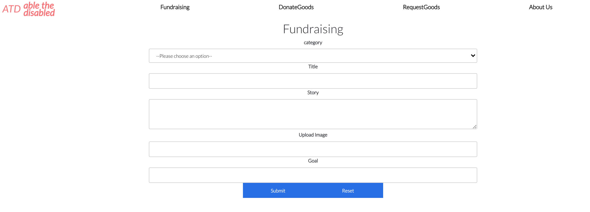

# AbleTheDisabled
A website that help Special needs families to start fund-raising and request goods and allow other people to donate money and goods. Developed by Raninder Dhillon, Neema Patel and Parghuzzat

# Features
1. Login/signup
2. Add new goods and  create fundraisers
3. Update goods and fundraisers
4. View all goods and fundraisers
5. Search for goods by categories
6. View User requests history
7. Progress bar describging how much part of goal achieved in raising money for a fundraising campaign

# Getting started
1. Fork this repository, then clone your fork of this repository.
2. Install dependencies using the npm install command.
3. There are two folders within the root.

- Server: The server is a PostgresSQL Database with express nodejs built ontop of it. Its purpose is to handle data, and export a JSON api. Start the web server using the npm run local command. The app will be served at http://localhost:3001/.

- Client: The client folder is a react app built seperately from the server which run by command: npm start. It runs at http://localhost:3000

# Dependencies 
- Node.js
- React
- Express
- Axios
- bcrypt
- cors
- pg
- stripe
 
# Final Product

